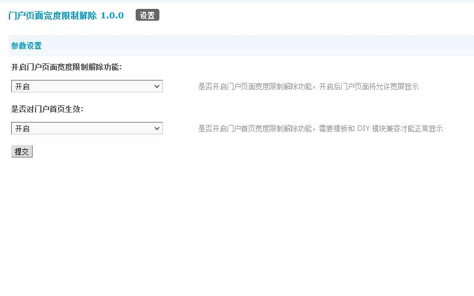
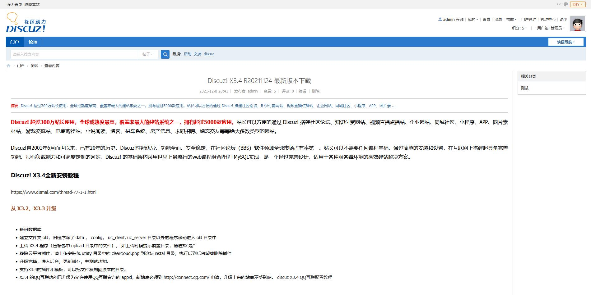
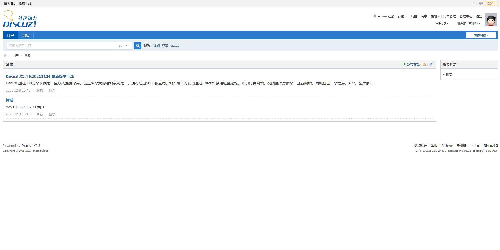
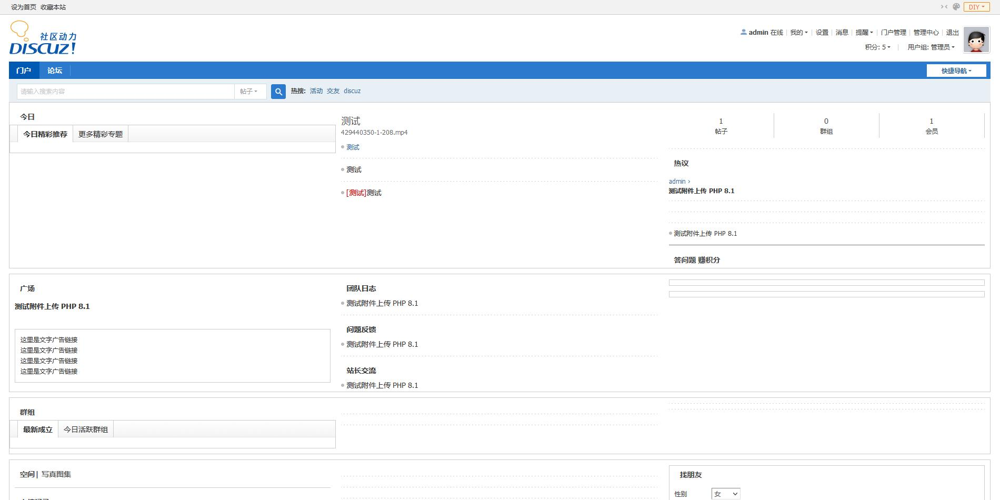

# 门户宽度限制解除

## 应用介绍

**您还在纠结其他页面都支持宽屏而门户页面只支持 960px 么？还在担心屏幕宽度不适配高分屏导致用户流失么？还在担心用户天天吐槽门户丑而无心运营么？**

本插件特别为此设计，可以方便的解除门户页面宽度限制，允许门户页面以宽屏显示。**加宽页面宽度大小，统一网站视觉效果，提升高分屏用户体验。**

## 开源信息

本插件使用 Apache 2.0 License 发布，并已经登录 GitHub 平台，地址为: https://github.com/laozhoubuluo/discuz_portalwidthauto 。

如有任何问题，欢迎您通过 Issue 反馈，或通过 Pull Requests 进行改进。

也欢迎您通过 Star 鼓励我们继续开发类似产品。

## 图片展示

